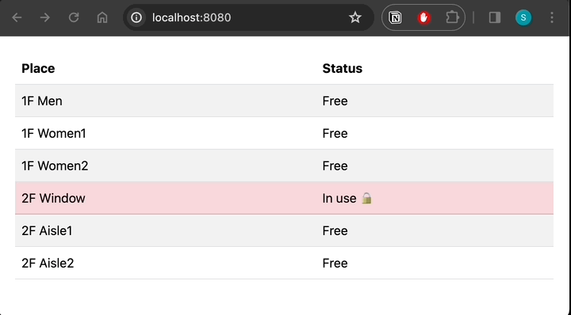

# Mock-Loo



## Description

This project is Mocking of toilet lock / unlock sensors.
It sends HTTP requests to looLock project instead of real sensors.

## Requirements

- JDK 21+

## How to run

```bash
git clone https://github.com/LooLookProject/mock-loo.git
cd mock-loo
./gradlew clean build
java -jar build/libs/mock-loo-0.0.1-SNAPSHOT.jar 
```

Open http://localhost:8080/ in your browser.

## How to use when you test looLock

if loolock is running on http://localhost:8080, you can run mock-loo with following command.

- add environment variable `api.base.url` to specify looLock's base url.
- run mock-loo with following command.

```bash
java -jar \
-Dserver.port=8081 \
-Dapi.base.url=http://localhost:8080 \
build/libs/mock-loo-0.0.1-SNAPSHOT.jar
```

or you can use your own `application-dev.yml` file.

- edit `application-dev.yml` file
- run mock-loo with following command.

```bash
java -jar build/libs/mock-loo-0.0.1-SNAPSHOT.jar \
--spring.config.location=application-dev.yml
```
